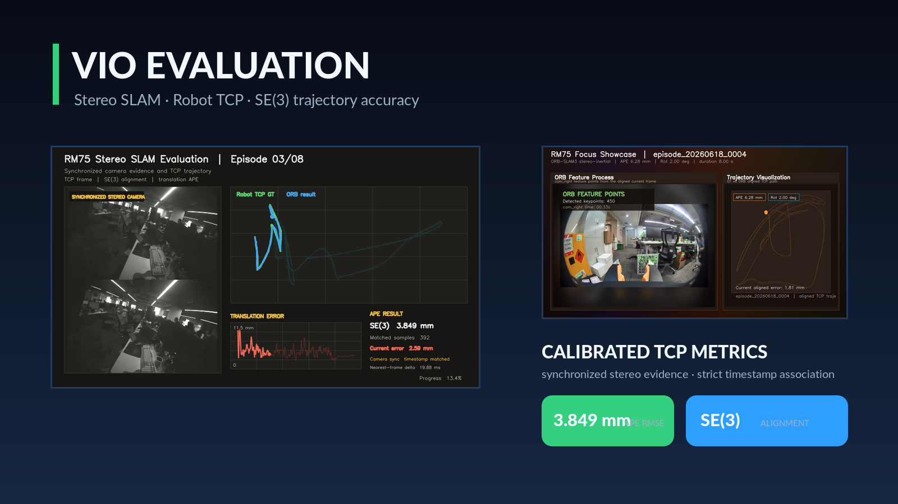
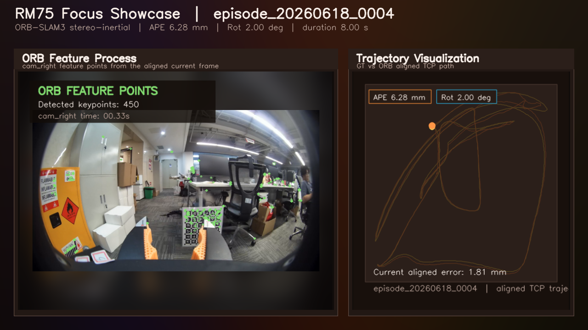

# vio_eval

> Stereo SLAM and VIO evaluation for calibrated robot TCP trajectories.

<p align="center">
  
</p>

<p align="center">
  <a href="#minimal-reproduction">Minimal reproduction</a> ·
  <a href="#verified-rm75-result">Results</a> ·
  <a href="#core-workflow">Workflow</a> ·
  <a href="#reproducible-adaptive-vio">Algorithm</a> ·
  <a href="docs/DELIVERY_SOP.md">Delivery SOP</a>
</p>

`vio_eval` turns synchronized stereo/IMU recordings and robot poses into an auditable trajectory comparison: calibrated coordinate conversion, timestamp association, rigid SE(3) alignment, APE/RPE metrics, and visual evidence.

| Best demonstrated APE RMSE | Portfolio size | Evaluation frame | Evidence |
| ---: | ---: | --- | --- |
| **3.849 mm** | **8** synchronized episodes | Robot TCP + SE(3), `scale=1` | Stereo frames · trajectories · error trace |

**Included capabilities**: RM75 TCP evaluation · ORB-SLAM3 stereo and stereo-inertial runners · AprilGrid hand-eye calibration · PTP/time-alignment tools · standalone viewers/reports · SXR tracking experiments.

Raw recordings, generated trajectories, third-party source trees, build outputs, and local delivery bundles are deliberately excluded from Git. Only the two short curated demos below are versioned. See [data/DATA_LAYOUT.md](data/DATA_LAYOUT.md) for the expected local layout.

## Verified RM75 Result

The published portfolio contains eight synchronized camera-and-trajectory episodes. All reported values use robot TCP trajectories with rigid **SE(3) alignment** (`scale=1`), and are translation APE RMSE values.

| Portfolio episode | Source episode | APE RMSE | Matched pairs |
| --- | --- | ---: | ---: |
| 01 | `episode_20260618_0004` | 6.281 mm | 1,097 |
| 02 | `episode_20260624_0001` | 7.369 mm | 655 |
| 03 | `episode_20260624_0004` | **3.849 mm** | 392 |
| 04 | `episode_20260624_0005` | 5.171 mm | 1,946 |
| 05 | `episode_20260707_0001` | 9.037 mm | 1,444 |
| 06 | `episode_20260707_0003` | 6.064 mm | 3,377 |
| 07 | `episode_20260707_0004` | 7.513 mm | 2,949 |
| 08 | `episode_20260707_0005` | 8.879 mm | 7,609 |

The source record for the table, including camera timestamp matching evidence, is [docs/results/rm75_8_episode_portfolio.csv](docs/results/rm75_8_episode_portfolio.csv). These are selected final visualizations, not a claim of performance on an independently held-out benchmark.



## Video Demos

- [Episode 03 — 3.849 mm APE RMSE](docs/assets/rm75_episode_03.mp4): synchronized stereo images, TCP ground truth and ORB trajectory, with per-frame translation error.
- [Episode 08 — 8.879 mm APE RMSE](docs/assets/rm75_episode_08.mp4): a longer, high-coverage trajectory that demonstrates the same synchronized evaluation layout.

The rendered videos are visual evidence only; the authoritative numeric records remain in the CSV above.

## Core Workflow

```text
Stereo / IMU recording + RM75 pose log
              │
              ▼
    Calibrated episode export
              │
              ▼
 ORB-SLAM3 trajectory generation
              │
              ▼
 Timestamp association / strict sync
              │
              ▼
Camera / IMU → TCP → SE(3) → metrics + viewer
```

## Minimal Reproduction

The supported delivery core is a dependency-light TCP trajectory evaluator. It includes a small synthetic fixture, so a fresh checkout can prove the coordinate chain and SE(3) metric contract without robot hardware, ORB-SLAM3, or proprietary recordings:

```bash
python3 -m pip install -r requirements-minimal.txt
python3 script/vio_eval.py demo --output-dir local/minimal_reproduction
python3 -m unittest discover -s tests -v
```

For a real exported camera pose CSV and robot TCP JSON:

```bash
python3 script/vio_eval.py evaluate \
  --estimate /data/episode/pose_camera.csv \
  --ground-truth /data/ground_truth/episode.json \
  --estimate-frame camera \
  --output-dir local/customer_episode
```

See [docs/DELIVERY_SOP.md](docs/DELIVERY_SOP.md) for acceptance criteria, IMU input, output review, and handoff requirements.

## Reproducible Adaptive VIO

The RM75 adaptive stereo-inertial algorithm is included as a small patch over a
pinned public ORB-SLAM3 commit—not as an opaque, machine-local source tree. It
corrects the configured IMU period, adds deterministic offline Local Mapping
synchronization, and provides an opt-in low-excitation initialization gate:

```bash
script/setup_orbslam3_adaptive_vio.sh \
  --orb-root /opt/ORB_SLAM3_adaptive_vio --build
```

The patch checksum, exact upstream revision, operating parameters, one-episode
command, and fixed-offset ablation procedure are documented in
[docs/ALGORITHM_REPRODUCTION.md](docs/ALGORITHM_REPRODUCTION.md). This algorithm
does not select its behavior from RM75 ground truth or post-hoc timing scans.

## Optional ORB-SLAM3 Workflow

The project remains a workstation-oriented research workspace for trajectory generation. A local ORB-SLAM3 build, calibration files, and a local dataset matching the data layout are required; no raw dataset is committed to this repository.

Verify a preserved batch configuration without running SLAM:

```bash
python3 script/run_orbslam3_rm75_best_batch.py \
  --episode-root data/gripper/gripper_data_6_24 \
  --gt-root data/ground_truth/rm75_6_24 \
  --episode-pattern 'episode_20260624_*' \
  --verify-only
```

Run one stereo-inertial episode and produce its TCP evaluation:

```bash
python3 script/run_orbslam3_tcp_eval.py \
  --episode-dir data/gripper/gripper_data2/episode_20260618_0004 \
  --ground-truth data/ground_truth/rm75_6_18/episode_20260618_0004.json \
  --camera-rig stereo_right \
  --mode stereo-inertial \
  --feature-preset low-texture \
  --imu-fast-init 0
```

Use `--help` on each entry point to adapt local ORB paths, timing offsets, and output roots.

## Repository Map

| Path | Purpose |
| --- | --- |
| `script/run_orbslam3_rm75_best_batch.py` | Preserved RM75 stereo reference batch runner |
| `script/run_orbslam3_tcp_eval.py` | Single episode ORB-SLAM3 export and TCP evaluation |
| `script/vio_eval.py` | Stable delivery CLI: demo and one-episode evaluation |
| `algorithms/orbslam3_adaptive_vio/` | Pinned upstream metadata for the adaptive VIO implementation |
| `script/setup_orbslam3_adaptive_vio.sh` | Safe clone, patch verification, and optional build entry point |
| `script/run_adaptive_imu_init_ablation.py` | Deterministic adaptive-gate ablation runner |
| `script/evaluate_vio_tcp_camera_evo.py` | Core calibrated trajectory evaluator used by the delivery CLI |
| `examples/minimal_reproduction/` | Versioned synthetic input for clean-machine verification |
| `docs/DELIVERY_SOP.md` | Delivery, acceptance, and handoff procedure |
| `script/visualize/` | Trajectory viewers, reports, and portfolio builders |
| `script/capture/` | Camera/robot acquisition and hardware checks |
| `script/experiments/` | Reproducible ablations and parameter sweeps |
| `data/calibration/` | Versioned camera and hand-eye calibration inputs |
| `docs/version_anchors/` | Reference implementation snapshots and recovery notes |
| `docs/` | Operational notes, result records, and published visual assets |

`script/README.md` provides the full script grouping. The formal recovered baseline and its scope are documented in [docs/version_anchors/RM75_BEST_COLLEAGUE_20260716.md](docs/version_anchors/RM75_BEST_COLLEAGUE_20260716.md).

## Result Semantics

- Robot `head_pose` used by SXR experiments is a device-provided reference trajectory, not an independently measured ground truth.
- RM75 comparisons depend on hand-eye calibration and time alignment. Keep the profile and offset record with every metric.
- The current preserved stereo reference executes the ORB-SLAM3 stereo binary. It does **not** fuse IMU merely because its generated YAML includes `IMU.*` calibration fields.

## Development Notes

Generated output belongs under `data/evaluation/workbench/` or `local/`. Keep only code, small calibration/configuration inputs, concise result records, and representative static figures under version control. This keeps the repository cloneable while retaining the exact evaluation method and visible final evidence.
